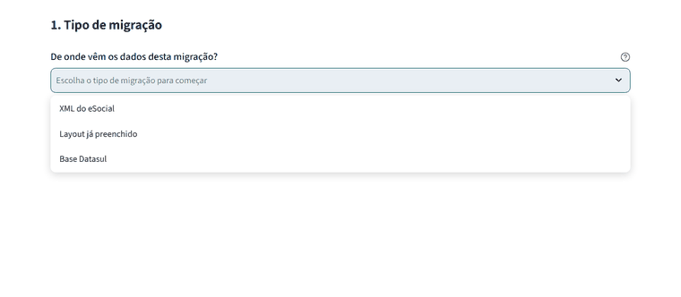
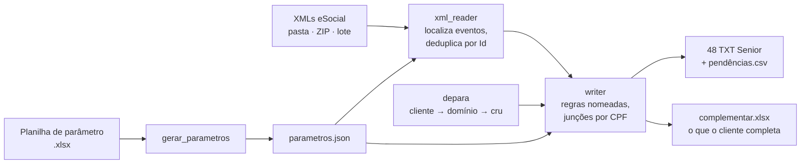

# Extrator eSocial → Senior HCM

[](https://github.com/GuilhermeFrancischetti-7/esocial-xml-extractor/actions/workflows/testes.yml)


> **English summary** — A Streamlit app that reads Brazilian eSocial XML events
> (payroll, hiring, leave, termination…) and converts them into the 48 import
> layouts of Senior HCM, for HR data migrations. The field mapping lives in a
> spreadsheet, not in code; ambiguous values become explicit *pending items*
> instead of plausible-but-wrong data. Tested on a real migration of ~650k XMLs
> and ~8k employees. Ships with a synthetic data generator so anyone can run it.

<!-- Substitua pelo GIF da demo: docs/demo.gif -->
<!--  -->

**Demo online:** _em breve_ · **Autor:** [Guilherme Francischetti](https://www.linkedin.com/in/)

---

## O problema

Toda empresa brasileira envia ao governo, pelo eSocial, o histórico completo dos
seus colaboradores em XML: admissão, alterações, afastamentos, folha, férias,
rescisão. Quando ela troca de sistema de RH, esses XMLs são a fonte mais
confiável para migrar os dados — mas o sistema novo não lê XML: espera dezenas
de arquivos posicionais com regras próprias de formato, códigos e chaves.

A solução anterior era um programa em Progress ABL que lia o XML **por posição
de caractere**: quebrava a cada variação de envelope e exigia código novo para
cada campo.

## A solução

Um app em Python/Streamlit que conduz a migração em seis etapas:

1. escolher o tipo de migração;
2. gerar a planilha de De/Para que o cliente preenche;
3. escolher os layouts de destino;
4. ler os XMLs (pasta, upload, ZIP dentro de ZIP ou uma leitura salva);
5. carregar o De/Para preenchido;
6. gerar os **48 layouts** Senior (561 campos) + relatório de pendências.



## Resultados no piloto real

| | |
|---|---|
| Volume processado | ~650 mil XMLs, ~8 mil colaboradores |
| Memória | 79 MB de XML lidos com **49 MB de pico** — o pico acompanha o maior arquivo, não a massa |
| Planilha complementar (40 mil linhas) | **78 s → 19 s** gravando em `write_only` com estilos registrados uma vez |
| Cobertura | 48 layouts, 561 campos, validados layout a layout com consultoria Senior |

## Decisões de design

- **O mapeamento vive na planilha, não no código.** Cada campo declara evento,
  caminho no XML, ação (`DIRETO`, `DEPARA_CLIENTE`, `REGRA`, `FIXO`…) e regra.
  `gerar_parametros.py` converte para um `parametros.json` versionado, então o
  diff mostra exatamente o que mudou no mapeamento entre versões. Código novo só
  entra para *mecanismos* genéricos.
- **Coluna vazia com pendência é melhor que dado plausível e errado.** Quando não
  há fonte confiável, o campo sai vazio e vai para `_pendencias.csv` com motivo.
  Exemplo: eventos como S-2230 só trazem a raiz do CNPJ; em vez de usar a raiz
  (válida, mas da granularidade errada), a filial é resolvida por junção pelo CPF
  com os eventos que a carregam.
- **Leitor genérico, sem código por evento.** A tag raiz de cada evento é deduzida
  dos caminhos da planilha; caminhos alternativos (`a | b`) cobrem o mesmo dado
  em eventos diferentes; nós repetidos (dependentes, rubricas) são descobertos
  sozinhos.
- **De/Para com precedência explícita:** tabela do cliente → tabela do cliente
  válida para todos os layouts → domínio oficial do eSocial → valor cru +
  pendência.
- **Robustez de entrada:** ZIP aninhado até 3 níveis, lotes com vários eventos,
  eventos duplicados descartados pelo `Id` do recibo, flags homônimas
  (`<evtRemun>S</evtRemun>` do S-1299) que não viram eventos fantasmas.
- **Leitura salva:** a massa já parseada vira um `.leitura` (zip com JSONL) e é
  reaberta sem varrer centenas de milhares de arquivos de novo.

## Como rodar

```bash
python -m venv .venv
.venv\Scripts\activate        # Linux/macOS: source .venv/bin/activate
pip install -r requirements.txt
python gerar_massa_demo.py    # cria exemplos/massa_demo com XMLs fictícios
streamlit run app.py
```

Na etapa 4, escolha **Pasta no disco** e informe `exemplos/massa_demo` — ou use o
botão *Baixar massa de demonstração* e envie o ZIP por upload.

## Testes

```bash
pip install pytest
pytest -q testes/test_extrator.py      # invariantes nos 48 layouts
python testes/validar_layouts.py       # relatório por layout
python testes/teste_ui.py              # percorre a interface inteira sem navegador
```

As invariantes: nenhum layout lança exceção, nenhuma linha duplicada, toda
linha tem o número de campos do layout. Rodam no GitHub Actions a cada push.

## Massa sintética

`gerar_massa_demo.py` monta os XMLs **a partir dos próprios caminhos do
`parametros.json`**: quando o mapeamento passa a usar uma tag nova, a massa de
demo passa a contê-la sem alterar o gerador. CPFs e CNPJs têm dígito verificador
válido e são aleatórios; os eventos de um mesmo colaborador são coerentes entre
si (CPF, filial, cargo, dependentes, rubricas).

## Estrutura

| Arquivo | Papel |
|---|---|
| `app.py` | Interface Streamlit (6 etapas) |
| `xml_reader.py` | Varre pasta/ZIP, identifica eventos, resolve caminhos, salva leituras |
| `writer.py` | Monta as linhas de cada layout; regras nomeadas em `REGRAS_IMPLEMENTADAS` |
| `depara.py` | Tabelas De/Para e precedência |
| `modelo_depara.py` | Gera a planilha de De/Para para o cliente |
| `complementar.py` | Planilha dos campos que o eSocial não tem e o cliente completa |
| `gerar_parametros.py` | Planilha de parâmetro → `parametros.json` |
| `gerar_dominios_esocial.py` | Tabelas de domínio oficiais do eSocial |
| `gerar_massa_demo.py` | Massa de XMLs fictícia |
| `parametro/` | Planilha de parâmetro (fonte da verdade do mapeamento) |
| `testes/` | pytest, validação de layouts e teste de UI |

## Stack

Python 3.12 · Streamlit · pandas · openpyxl · ElementTree · pytest · GitHub Actions

## Licença

MIT — veja [LICENSE](LICENSE). Os leiautes do eSocial e da Senior são
especificações públicas dos respectivos órgãos/fornecedores.
